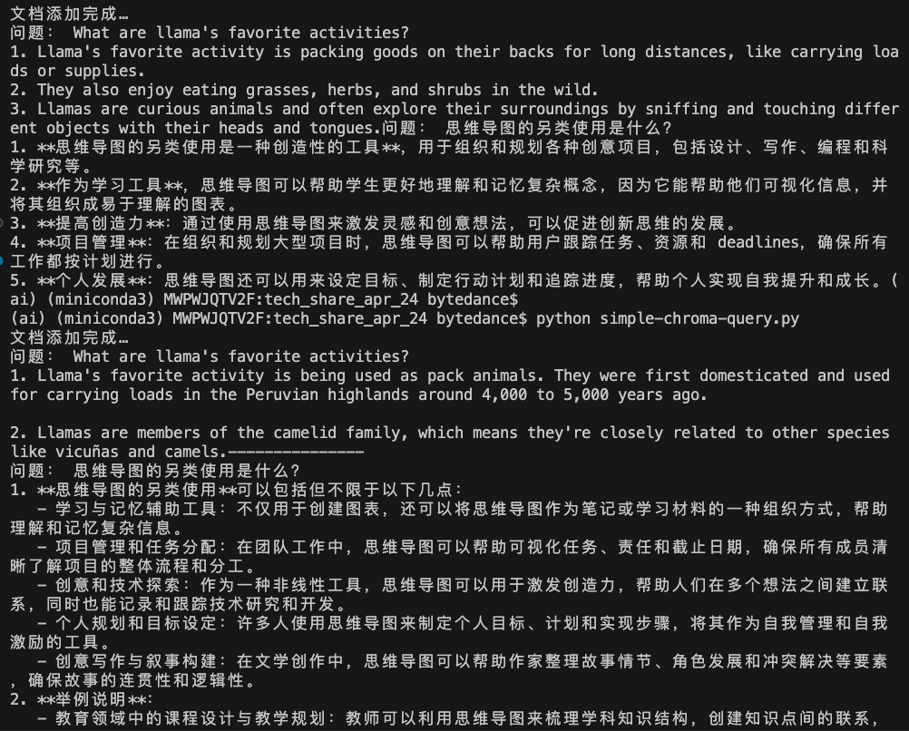

# simple-embedding-rag

## 介绍
学习 embeddings and rag 相关的资料

## 安装依赖
```shell
pip install -r requirements.txt
```

## RAG with DB 的示例
先运行 chromadb：
```shell
chroma run --host localhost --port 8000 --path ./vectordb/chromadb
```

运行代码片段：
```shell
python ./simple-chroma-query.py
```

效果：

